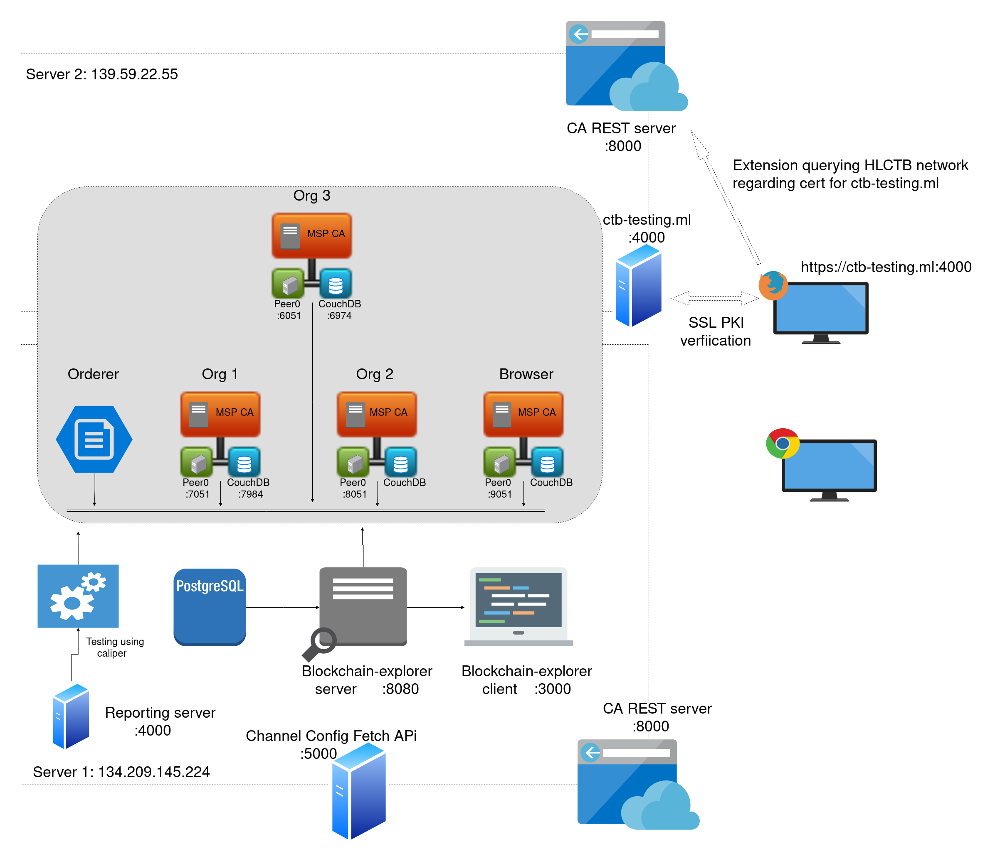

# CTB Using Hyperledger fabric

This is based on paper [Certificate Transparency Using Blockchain](https://eprint.iacr.org/2018/1232).



## Generate crypto-config and transactions
```
./ctb.sh generate
```

## Starting network and testing
```
./ctb.sh up
```

## Create channel and join peers
```
./ctb.sh channel
```

Note: Single command `./ctb.sh generate <<< "Y" && ./ctb.sh up  <<< "Y" && ./ctb.sh channel <<< "Y"`

## Structure
Certificates are available in `scripts/certs`. There are:
- `domain.*`: domain related crypto material
- `ca.*`: CA related crypto material
- `d2.*`: new crypto material for same domain signed by current cert

chaincode/main.go contains chaincode CTB described in above paper.

I have modified [byfn](https://hyperledger-fabric.readthedocs.io/en/release-1.4/build_network.html) scripts and config files to incorporate CTB architecture.

## Demo
This project contains a sample server/client application for testing different scenarios on HLCTB network. Code for sample application is available under `test_app` folder.

For more information, refer [run_demo.md](docs/01-run_demo.md).

## Hosting HLCTB on cloud
As the end product, this network would be running on cloud. And its service will be used for adding the necessary layer of security for certificate verification in SSL/TLS PKI communications.

On how to deploy HLCTB on a server, refer [deploying_to_cloud.md](docs/02-deploying_to_cloud.md).
